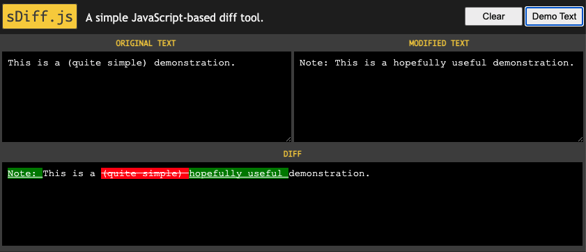

# sDiff.js - A simple Javascript based text-diff tool.

* simply configurable Javascript class for text diffing (character/word/line-based)
* implements a diff algorithm described in the Wikipedia (https://en.wikipedia.org/wiki/Longest_common_subsequence_problem, last visited 2021-07-30)
* source file: `src/sdiff.js`
* example integration in website: download and open `sample-page/index.html` in your browser
* sample usage:
```html
<pre id="diff-output"></pre>

<script src="sdiff.js"></script>

<script>
    var originalText = 'This is a (quite simple) demonstration.';
    var originalText = 'Note: This is a hopefully useful demonstration.';
    
    var diff = new sDiff(originalText, modifiedText);
    
    document.getElementById('diff-output').innerHTML = diff.render();
</script>
```


## Options
* Format:
```js
var options = {
    delimiters: [ ' ', '.', '\n' ],
    noDiffMessage: '<div class="no-diff">The texts are identical! <span>✓</span></div>'
};
```
* Passing options: `var diff = new sDiff(originalText, modifiedText, options);` or, for a given instance, by `diff.setOptions(options);`
* Possible options:
  * `delimiters`: array of characters used to split the strings into "words" (see example above)
     * `delimiters: []` yields a character-based diff
     * `delimiters: [ ' ', '\n' ]` is the default setting (word-based diff) 
  * `noDiffMessage`: html to be rendered when strings coincide (see example above)
  * `replacements`: list of substitutions to make some (otherwise invisible or unobtrusive) differences in the rendered HTML more obvious, e.g.
    ```js
    replacements: [
        { search: '\n', only: 'del', replacement: '[NEWLINE]' },
        { search: '\n', only: 'ins', replacement: '[NEWLINE]\n'}
    ],
    ```
    replaces a removed newline with the string `[NEWLINE]` and an added newline with the string `[NEWLINE]\n` 
  * `tags`: specify, how the diff will be rendered as HTML. The default setting is  
    ```js
    tags: {
        del: '<del>{ word }</del>',
        ins: '<ins>{ word }</ins>',
        keep: '<span>{ word }</span>'
    };
    ```
    If you prefer other HTML tags, just modify this, like so
    ```js
    tags: {
        del: '<span class="deleted">{ word }</span>',
        ins: '<span class="inserted">{ word }</span>',
        keep: '<span class="identical">{ word }</span>'
    }
    ```